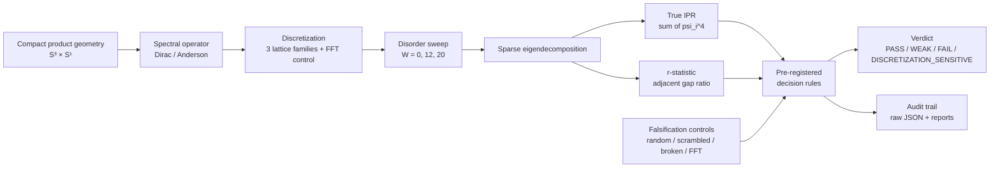

# GeoSpectra Lab

**A falsification-first numerical harness for finite-lattice spectral toy geometries**

[](https://doi.org/10.5281/zenodo.20252650)
[](https://creativecommons.org/licenses/by/4.0/)


> **One-line:** This is **not** a physics claim. It is an instrument that takes a compact product geometry, puts a spectral operator on a finite lattice, and asks **how would I be fooled?** before accepting any signal as real.

---

## ⚠️ Current Status (2026-06-03)

| Item | Value |
|---|---|
| **Latest verdict (v0.1.24)** | **`DISCRETIZATION_SENSITIVE / GEOMETRY_AGNOSTIC` (FINAL)** |
| **Aggregate true-IPR contrast** (W=20 vs W=0) | **7.07×** (≈ 7.15× before S³ Dirac operator fix — **<1.1% change**, signal survived correction) |
| **Specificity cascade** | 5 levels — see Key Result below |
| **Total cases analyzed** | 306 (216 Gate 4B + 54 negative controls + 18 wilson scrambled + 18 spectral extended) |
| **Active direction** | Per-family divergence audit (ring stable, spectral_circle weakening); planned port to S³×S² per Tom Lawrence redirect (CAMP 2026-05-26) |
| **Active falsification tests** | FT-1 (r-stat W=0 baseline anomaly), FT-2 (inter-family IPR divergence), FT-3 (FSS strengthening vs denominator artifact) — see `docs/CLAIMS_AND_CAVEATS.md` |

**What "DISCRETIZATION_SENSITIVE / GEOMETRY_AGNOSTIC" means in one sentence:**
the harness can distinguish a lattice product structure from random / scrambled / broken baselines, but it does **not** distinguish between Wilson-term details inside the lattice family — i.e. it validates **the lattice product topology**, not **S³×S¹ physics**.

---

## What This Repository Does

- Builds discretized Dirac-style spectral operators on compact product toy geometries (current case study: **S³×S¹**, lattice dimension N ≤ 896).
- Runs **pre-registered** finite-size-scaling sweeps under Anderson-style on-site disorder.
- Measures **true eigenvector-based** Inverse Participation Ratio (IPR) and adjacent gap ratio (r-statistic).
- Compares the geometric signal against four classes of falsification controls:
  random Hermitian, scrambled geometry, broken Wilson term, alternative discretization (FFT vs lattice).
- Logs every claim with an explicit evidence marker and an explicit list of what each result does **not** mean.

## What This Repository Does **NOT** Do

- Does **not** prove covariant compactification.
- Does **not** bypass the Witten / Lichnerowicz no-go theorems.
- Does **not** prove chiral fermions or protected chiral zero modes.
- Does **not** derive the Standard Model gauge group `SU(3) × SU(2) × U(1)`.
- Does **not** validate any cosmological or physical extra-dimensional model.
- Does **not** claim a thermodynamic limit (N → ∞) — all results are finite-lattice.
- Does **not** prove `S³×S¹` is the correct geometry for anything physical — see "Inspiration" below.
- Does **not** carry institutional endorsement from any third party, including Tom Lawrence.

---

## Key Result — 5-level specificity cascade (v0.1.24, FINAL)

| Level | Test | FSS slope | Verdict | What it tells us |
|---|---|---:|---|---|
| L1 | Random Hermitian matrix | −1.14 (WEAKENING) | ✅ **REJECTS** | Pure randomness fails the pattern — harness is not fooled by noise. |
| L2 | Scrambled geometry (S¹ permutation) | −0.90 (WEAKENING) | ✅ **REJECTS** | Broken topology fails — product structure matters. |
| L3 | FFT discretization vs lattice discretization | spectral_circle −0.48 vs ring +0.01 | ✅ **DISTINGUISHES** | **The harness is sensitive to the discretization method itself.** |
| L4 | Within lattice family (ring, wilson_ring) | both STABLE | ✅ **ACCEPTS** | Any lattice product passes — robust within method. |
| L5 | Wilson-term internal details (scrambled wilson term) | −0.07 (STABLE) | ❌ **DOES NOT DISTINGUISH** | Wilson structure is irrelevant — sensitivity ends at L3. |

**Conclusion:** the harness has **specificity up to L3**, not L5. Any external claim about this repository must respect that ceiling.

Full report: [`reports/GATE4B_SPECIFICITY_VERDICT_v0.1.24.md`](reports/GATE4B_SPECIFICITY_VERDICT_v0.1.24.md)
Unified audit: [`reports/UNIFIED_RESULT_RECONCILIATION_AUDIT_v0.1.24.md`](reports/UNIFIED_RESULT_RECONCILIATION_AUDIT_v0.1.24.md)

---

## Quickstart (10 minutes)

```bash
git clone https://github.com/sergeeey/N-7-GeoSpectra-Lab.git
cd N-7-GeoSpectra-Lab

# Minimal environment (Python 3.11+)
pip install -r requirements.txt

# Run the test suite (43 test files, 200+ tests)
pytest -q tests/

# Run a smoke version of the radion stabilization study
python scripts/radion_stabilization.py --quick

# Run synthetic r-statistic controls (Poisson / GOE / GUE)
python scripts/r_stat_controls.py --quick
```

## Reproduce the Headline Result

The Gate 4B v0.1.24 grid (216 cases) is heavy — peak ≈ 10 GiB RAM on the largest case (`N=128, j_max=3`). Use a host with at least 32 GiB RAM.

```bash
# Full corrected rerun (≈ 1.8 hours on 16 vCPU / 32 GiB host)
python scripts/run_gate4_batched.py \
  --output-base reports/RUNS/gate4_fss_v0.1.24 \
  --protocol-version v0.1.24 \
  --ipr-metric-version v0.1.24_true_ipr_corrected_s3_dirac
```

Pre-registered protocol: [`reports/GATE_4B_RERUN_PROTOCOL_v0.1.24.md`](reports/GATE_4B_RERUN_PROTOCOL_v0.1.24.md)

---

## Architecture



Source modules: `cc_toy_lab/{geometry, spectral, radion, topology, controls, discovery}/`.

---

## Documentation Map

| You want to know... | Read this |
|---|---|
| Why this project exists and what question it actually asks | [`docs/RESEARCH_CONTEXT.md`](docs/RESEARCH_CONTEXT.md) |
| Exactly what can and cannot be claimed externally | [`docs/CLAIMS_AND_CAVEATS.md`](docs/CLAIMS_AND_CAVEATS.md) |
| 15 main artefacts and their outcome cards | [`docs/OUTCOMES.md`](docs/OUTCOMES.md) |
| Hardware needed to reproduce the heavy grid | [`docs/HARDWARE_REQUIREMENTS.md`](docs/HARDWARE_REQUIREMENTS.md) |
| 5-phase roadmap | [`docs/ROADMAP.md`](docs/ROADMAP.md) |
| The current FINAL verdict reasoning | [`reports/GATE4B_SPECIFICITY_VERDICT_v0.1.24.md`](reports/GATE4B_SPECIFICITY_VERDICT_v0.1.24.md) |
| Cross-script reproduction audit (one loader, one formula) | [`reports/UNIFIED_RESULT_RECONCILIATION_AUDIT_v0.1.24.md`](reports/UNIFIED_RESULT_RECONCILIATION_AUDIT_v0.1.24.md) |
| What was tried and failed (first-class results) | [`reports/NULL_RESULTS.md`](reports/NULL_RESULTS.md) |
| Open scientific issues | [`reports/ISSUES_SCIENTIFIC.md`](reports/ISSUES_SCIENTIFIC.md) |
| Full GitHub showcase audit (engineering hygiene + safety) | [`docs/GITHUB_SHOWCASE_AUDIT.md`](docs/GITHUB_SHOWCASE_AUDIT.md) |

---

## Inspiration and Attribution

This project was initially inspired by broader questions in compact product geometries, Kaluza–Klein-style reasoning, and **covariant compactification**, including public work by **Tom Lawrence**.

Tom Lawrence's work is the analytical / theoretical line of inquiry that initially motivated the geometric choice of `S³×S¹` as a test case. GeoSpectra is the independent computational line.

| Resource | Link |
|---|---|
| Tom Lawrence — Website | https://warpedandbroken.com/ |
| Tom Lawrence — LinkedIn | https://www.linkedin.com/in/tomlawrence_45533/ |
| Tom Lawrence — ResearchGate | https://www.researchgate.net/profile/Tom-Lawrence |
| Tom Lawrence — ORCID | [0000-0002-2741-8226](https://orcid.org/0000-0002-2741-8226) |
| (2021) Tangent space symmetries in GR and teleparallelism — IJGMMP | [arXiv:2211.07586](https://arxiv.org/abs/2211.07586) · [DOI](https://doi.org/10.1142/S0219887821400089) |
| (2022) Product manifolds as realisations of general linear symmetries — IJGMMP | [arXiv:2203.09473](https://arxiv.org/abs/2203.09473) · [DOI](https://doi.org/10.1142/S0219887822400060) |
| (2023) Covariant Compactification: a Radical Revision of Kaluza–Klein Unification — preprint | [Preprints.org 202303.0314](https://www.preprints.org/manuscript/202303.0314/v1) |
| (2025) Symmetries of Field Configurations and No-Go Theorems — preprint | [Preprints.org 202510.2222](https://www.preprints.org/manuscript/202510.2222) |
| (2024) General Relativity — its beauty, its curves, its rough edges... — essay (Minkowski Institute Press) | [PDF](https://www.minkowskiinstitute.com/MIPJ/Lawrence.pdf) |
| (2021) Do the symmetries of product spaces hold the key to unification? — Symmetry 2021 MDPI | [DOI](https://doi.org/10.3390/Symmetry2021-10740) |

**Independence statement.** GeoSpectra is developed independently by Sergey Boyko. It is **not** endorsed by Tom Lawrence. All errors, interpretations and claims in this repository are the author's own. The numerical results in this repository are not a test of Tom Lawrence's theory directly — per his own assessment at CAMP 2026-05-26, S³×S¹ is closer to original Kaluza–Klein style than to his covariant compactification framework, which requires at least two extra dimensions (next planned port: S³×S²).

---

## Author

**Sergey Boyko** — independent researcher
Affiliation: Ronin Institute for Independent Scholarship 2.0 (Research Scholar)
ORCID: [0009-0009-2178-5701](https://orcid.org/0009-0009-2178-5701)
Email: sergey.boyko@ronininstitute.org (academic) · sergeikuch80@gmail.com (personal)

GitHub: [@sergeeey](https://github.com/sergeeey)
Project repository: https://github.com/sergeeey/N-7-GeoSpectra-Lab

---

## How to Cite

If you use this methodology or reference this work, please cite via the metadata in [`CITATION.cff`](CITATION.cff) or:

> Boyko, S. (2026). *A Falsification-First Validation Harness for Discretized Spectral Operators on Compact Product Manifolds.* Zenodo. https://doi.org/10.5281/zenodo.20252650

---

## License

Released under [Creative Commons Attribution 4.0 International (CC BY 4.0)](LICENSE).
You may share and adapt the material, including for commercial purposes, with attribution.

---

## A Note on the Repository

This repository is intentionally a **methodology project**, not a marketing project.

- Negative results are first-class artefacts (see [`reports/NULL_RESULTS.md`](reports/NULL_RESULTS.md)).
- Operator bugs are openly documented along with their corrected reruns (see `reports/INCIDENT_GATE4B_v0.1.24_OOM_2026-05-25.md`, commit `093573b`).
- Each released verdict carries an explicit list of what it does **not** entail.
- A separate file [`docs/CLAIMS_AND_CAVEATS.md`](docs/CLAIMS_AND_CAVEATS.md) governs what may and may not be said externally.

If you find a wrong number, a misleading sentence, or a missing caveat, **please open an issue** — that is the most valuable contribution this project can receive.
