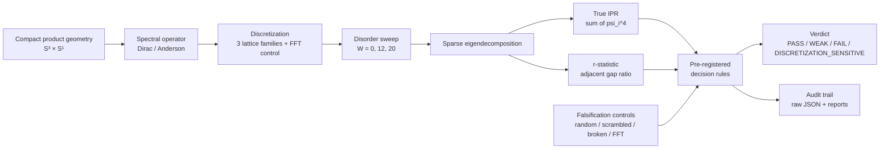

# GeoSpectra Lab

**A falsification-first numerical harness for finite-lattice spectral toy geometries**

[](https://doi.org/10.5281/zenodo.20252650)
[](https://creativecommons.org/licenses/by/4.0/)


> **One-line:** This is **not** a physics claim. It is an instrument that takes a compact product geometry, puts a spectral operator on a finite lattice, and asks **how would I be fooled?** before accepting any signal as real.

---

## Two Research Tracks

This repository contains two independent research projects on compact geometries:

| | Track A — Numerical | Track B — Algebraic |
|---|---|---|
| **Geometry** | S³×S¹ finite lattice | S³×S⁶ spectral triple |
| **Method** | Eigensolver + IPR / r-stat | Index theory (Atiyah-Singer) + exact arithmetic |
| **Verdict** | `DISCRETIZATION_SENSITIVE` | Exact S⁶ index (=1), internally-certified 1D kernel — but the full S³×S⁶ operator has **no zero mode** for the round/Levi-Civita S³ construction actually used (KT-8, 2026-07-17); N_gen=3 is **not yet established** as a physical result |
| **Key result** | 7.07× signal; geometry-agnostic | ind(D_{S⁶}⊗S⁻)=1 per channel — a mathematical index, not yet shown to be a massless 4D fermion mode |
| **Tests** | ~500 regression tests | **2500+ tests** (fractions.Fraction, zero float ops; 2512 passed/4 skipped independently reproduced 2026-07-15) |
| **Directory** | `cc_toy_lab/`, `scripts/`, `tests/` | [`tom_s3_spinor_toy/`](tom_s3_spinor_toy/) |
| **Entry point** | `reports/GATE4B_SPECIFICITY_VERDICT_v0.1.24.md` | `tom_s3_spinor_toy/RESEARCH_STATUS_REPORT.md` |

**Track A** explored whether a lattice product structure produces a robust spectral signal. It does — but the signal is DISCRETIZATION_SENSITIVE, not specific to S³×S¹ physics.

**Track B** constructs an exact Atiyah-Singer index computation on the S⁶ factor
of S³×S⁶ geometry, with an internally-certified one-dimensional local kernel:
- G73: ind(D_{S⁶}⊗S⁻) = 1 per triality channel
- G74A: Lichnerowicz gap + G₂-Schur → dim ker = 1 on every non-trivial sector
  (certified); trivial-component rank = 1 verified by three independent internal
  routes incl. a closed-form analytic derivation (Round 59, 2026-07-14);
  external review outstanding (L4B, see below)
- G74B: sign(ind) = +1 → left-handed excess → SM chirality label

**Blocking gap, tool-and-literature-verified (KT-8, 2026-07-17):** the physical
claim requires a zero mode of the *full* nine-dimensional internal Dirac
operator on S³×S⁶, not the S⁶ factor alone. For the round, untwisted
Levi-Civita S³ actually used throughout this project (product metric, product
connection, twist pulled back from S⁶ only), the full operator provably has
**no zero mode**: $D_{\mathrm{full}}^2=D_{S^3}^2\otimes1+1\otimes D_{S^6,S^-}^2
\geq(3/2\rho_3)^2>0$ regardless of the S⁶ factor's own index. **N_gen=3 is
therefore not yet an established physical result** — the index above computes
a mathematical object (zero modes of the S⁶-factor operator alone), not a
demonstrated massless 4D fermion. A torsion-deformed S³ connection provides a
mathematical (not physical) candidate escape route: the obstruction is
removable at computable parameter values, but no physical principle is known
for selecting them over the standard connection used elsewhere in this
project. See `reports/PROJECT_360_ROUND3_SYNTHESIS.md` (KT-8 through KT-11)
and `tom_s3_spinor_toy/preprint.tex` §Open Problems for full derivations.

**Dimension correction:** the total spacetime dimension of the ansatz actually
used is **13** (4 external + 3 + 6), not 10 as earlier phrasing implied — "10D"
conflated a spinor representation's dimension with a spacetime dimension count.
No consistent 13-dimensional parent theory is claimed (standard supergravity
is capped at 11D).

**Open dependency (honestly flagged in G67/G68/G73 themselves, independent of
the KT-8 gap above):** even granting a resolution of KT-8, the "×3 channels ⟹
N_gen=3" step assumes three geometrically distinct octonion-multiplication
channels (L_p, R_p, T_p) each appear in the S³×S⁶ Dirac action — gate
**G67-C3, 2/3 closed**. G68 (2026-06-21) proves L and R are genuinely
inequivalent Clifford(0,7) representations (pseudoscalar Ω_L=+I≠Ω_R=−I). The
third (vector, 8_v) channel remains open, needs G72/Tom input. G44 (2026-06-20)
shows G₂ (S⁶'s isotropy group) cannot distinguish the three SO(8) triality reps
by G₂-content alone (8_v≅8_s≅8_c as G₂-modules) — the same fact G73 uses, for a
different purpose. See `TOM_RECONSTRUCTION_ACH_MATRIX.md` Case 7 for the full
reconciliation.

---

## Industrial Applications

The spectral-fingerprint method built here (Track A: graph-Laplacian eigenvalue
signatures on finite lattices) has been adapted for a commercial use case — see
[GeoSpectra-Industrial](https://github.com/sergeeey/GeoSpectra-Industrial) (ScanGuard).
Same core signal-detection principle, different question: instead of "is this
signal specific to S³×S¹ physics?" it asks "is this 3D scan anomalous?".
Pilot-ready MVP (Two-Mode Architecture, 20 ADRs), seeking first real-scan
validation partners. Independent codebase, independent benchmarks.

---

## ⚠️ Current Status — Track A (2026-06-03)

| Item | Value |
|---|---|
| **Latest verdict (v0.1.24)** | **`DISCRETIZATION_SENSITIVE / GEOMETRY_AGNOSTIC` (FINAL)** |
| **Aggregate true-IPR contrast** (W=20 vs W=0) | **7.07×** (≈ 7.15× before S³ Dirac operator fix — **<1.1% change**, signal survived correction) |
| **Specificity cascade** | 5 levels — see Key Result below |
| **Total cases analyzed** | 306 (216 Gate 4B + 54 negative controls + 18 wilson scrambled + 18 spectral extended) |
| **Active direction** | Per-family divergence audit (ring stable, spectral_circle weakening); planned port to S³×S² per Tom Lawrence redirect (CAMP 2026-05-26) |
| **Active falsification tests** | FT-1 (r-stat W=0 baseline anomaly), FT-2 (inter-family IPR divergence), FT-3 (FSS strengthening vs denominator artifact) — see `docs/CLAIMS_AND_CAVEATS.md` |

**What "DISCRETIZATION_SENSITIVE / GEOMETRY_AGNOSTIC" means in one sentence:**
the harness can distinguish a lattice product structure from random / scrambled / broken baselines, but it does **not** distinguish between Wilson-term details inside the lattice family — i.e. it detects **a lattice-discretized product-structure pattern**, not **S³×S¹ physics**.

---

## Current Claim Boundary

```text
Observed signal             ✅ yes
Survives S³ Dirac fix       ✅ yes (7.15× → 7.07×, <1.1% change)
Rejects random noise        ✅ yes (L1)
Rejects scrambled S¹        ✅ yes (L2)
Distinguishes FFT vs lattice ✅ yes (L3)
Specific to S³×S¹ physics   ❌ no
Physics claim               ❌ no
Best verdict                DISCRETIZATION_SENSITIVE / GEOMETRY_AGNOSTIC
```

**Want this on one page?** → [`docs/PROJECT_SKETCH.md`](docs/PROJECT_SKETCH.md) (3-minute read)

---

## Track A — What the Numerical Harness Does

- Builds discretized Dirac-style spectral operators on compact product toy geometries (current case study: **S³×S¹**, largest operator dimension N = 13824 at s1_size=128; S³ Hilbert dimension 108 per S¹ site. *Note: earlier docs cited N≤896 — a single-shell labeling erratum corrected in `reports/DIMENSION_DISCREPANCY_AUDIT_v0.1.25.md`*).
- Runs **pre-registered** finite-size-scaling sweeps under Anderson-style on-site disorder.
- Measures **true eigenvector-based** Inverse Participation Ratio (IPR) and adjacent gap ratio (r-statistic).
- Compares the geometric signal against four classes of falsification controls:
  random Hermitian, scrambled geometry, broken Wilson term, alternative discretization (FFT vs lattice).
- Logs every claim with an explicit evidence marker and an explicit list of what each result does **not** mean.

## Track A — What the Numerical Harness Does NOT Do

- Does **not** prove covariant compactification.
- Does **not** prove chiral fermions, protected zero modes, or SM chirality.
- Does **not** derive the Standard Model gauge group `SU(3) × SU(2) × U(1)`.
- Does **not** validate any cosmological or physical extra-dimensional model.
- Does **not** claim a thermodynamic limit (N → ∞) — all results are finite-lattice.
- Does **not** prove `S³×S¹` is the correct geometry for anything physical.
- Does **not** carry institutional endorsement from any third party, including Tom Lawrence.

## Track B — What the Algebraic Project Establishes

See [`tom_s3_spinor_toy/`](tom_s3_spinor_toy/) for full details and 2210 tests
(`pytest tom_s3_spinor_toy/tests/` only; running the full directory including
`experiments/` gives 2488 collected as of 2026-07-13, see
`tom_s3_spinor_toy/experiments/20260713-round58-readiness-audit/decision.md` —
different scope, not a discrepancy).

- **ind(D_{S⁶}⊗S⁻) = 1 per triality channel exactly** (G73, PROMOTE 29/29) — a
  mathematical index on the S⁶ factor alone. **"N_gen = 3" is NOT yet an
  established physical result:** the full internal Dirac operator on S³×S⁶ has
  no zero mode for the round Levi-Civita S³ construction actually used (KT-8,
  2026-07-17, tool-and-literature-verified three times) — see "Status
  correction" below
- **dim ker = 1, internally certified:** Lichnerowicz spectral gap + G₂-Schur
  certify no extra zero modes on every non-trivial isotypic component (G74A +
  `20260713-round52`→`round56` general bound, PROMOTE); the trivial-component
  rank = 1 is verified by three independent internal routes — a from-scratch
  reimplementation blind to the original code, a full-fibre completeness +
  Hermiticity audit, and a closed-form analytic derivation (the amplitude IS
  the Killing-spinor Dirac eigenvalue −√3; twisting correction vanishes by rep
  theory) — see `tom_s3_spinor_toy/experiments/20260714-round59-trivial-rank-certification/`;
  external review outstanding (L4B in `tom_s3_spinor_toy/preprint.tex` Open Problems)
- **SM chirality:** sign(ind) = +1 → net left-handed excess, unconditional; all
  three modes purely left-handed under the same internally-certified L4B rank
  result above (G74B, PROMOTE 31/31)
- **SM fermion content:** 3+3̄+1+1 per generation from three independent routes — SO(8) triality (G67), CSDR on G₂/SU(3) (G69), SO(4)×G₂ rep theory (G24)
- **Exact arithmetic:** `fractions.Fraction` throughout — zero floating-point operations in the core index chain

Track B does NOT: claim S³×S⁶ is the physical compactification; derive the SM
gauge group; fix coupling constant λ (free parameter, enforced by test suite);
**establish that the full internal Dirac operator has a zero mode (KT-8:
it provably does not, for the round Levi-Civita S³ construction used here)**;
claim the ansatz is 10-dimensional (it is 13-dimensional, 4+3+6).

---

## Key Result — 5-level specificity cascade (v0.1.24, FINAL)

| Level | Test | FSS slope | Verdict | What it tells us |
|---|---|---:|---|---|
| L1 | Random Hermitian matrix | −1.14 (WEAKENING) | ✅ **REJECTS** | Pure randomness fails the pattern — harness is not fooled by noise. |
| L2 | Scrambled geometry (S¹ permutation) | −0.90 (WEAKENING) | ✅ **REJECTS** | Broken topology fails — product structure matters. |
| L3 | FFT discretization vs lattice discretization | spectral_circle −0.48 vs ring +0.01 | ✅ **DISTINGUISHES** | **The harness is sensitive to the discretization method itself.** |
| L4 | Within lattice family (ring, wilson_ring) | both STABLE | ✅ **ACCEPTS** | Any lattice product passes — robust within method. |
| L5 | Wilson-term internal details (scrambled wilson term) | −0.07 (STABLE) | ❌ **DOES NOT DISTINGUISH** | Wilson structure is irrelevant — sensitivity ends at L3. |

**Conclusion:** the harness has **specificity up to L3**, not L5. Any external claim about this repository must respect that ceiling.

Full report: [`reports/GATE4B_SPECIFICITY_VERDICT_v0.1.24.md`](reports/GATE4B_SPECIFICITY_VERDICT_v0.1.24.md)
Unified audit: [`reports/UNIFIED_RESULT_RECONCILIATION_AUDIT_v0.1.24.md`](reports/UNIFIED_RESULT_RECONCILIATION_AUDIT_v0.1.24.md)

---

## Quickstart (10 minutes)

```bash
git clone https://github.com/sergeeey/N-7-GeoSpectra-Lab.git
cd N-7-GeoSpectra-Lab

# Minimal environment (Python 3.11+)
pip install -r requirements.txt

# Full regression suite (494 tests across 44 files, cc_toy_lab track)
pytest -q tests/

# Algebraic spinor suite — Track B (2210 tests, exact arithmetic)
pytest -q tom_s3_spinor_toy/tests/ --tb=no

# Run a smoke version of the radion stabilization study
python scripts/radion_stabilization.py --quick

# Run synthetic r-statistic controls (Poisson / GOE / GUE)
python scripts/r_stat_controls.py --quick
```

## Reproduce the Headline Result

The Gate 4B v0.1.24 grid (216 cases) is heavy — peak ≈ 10 GiB RAM on the largest case (`N=128, j_max=3`). Use a host with at least 32 GiB RAM.

```bash
# Full corrected rerun (≈ 1.8 hours on 16 vCPU / 32 GiB host)
python scripts/run_gate4_batched.py \
  --output-base reports/RUNS/gate4_fss_v0.1.24 \
  --protocol-version v0.1.24 \
  --ipr-metric-version v0.1.24_true_ipr_corrected_s3_dirac
```

Pre-registered protocol: [`reports/GATE_4B_RERUN_PROTOCOL_v0.1.24.md`](reports/GATE_4B_RERUN_PROTOCOL_v0.1.24.md)

---

## Architecture



Source modules: `cc_toy_lab/{geometry, spectral, radion, topology, controls, discovery}/`.

---

## Documentation Map

### Track A — Numerical
| You want to know... | Read this |
|---|---|
| Why this project exists and what question it actually asks | [`docs/RESEARCH_CONTEXT.md`](docs/RESEARCH_CONTEXT.md) |
| Exactly what can and cannot be claimed externally | [`docs/CLAIMS_AND_CAVEATS.md`](docs/CLAIMS_AND_CAVEATS.md) |
| 15 main artefacts and their outcome cards | [`docs/OUTCOMES.md`](docs/OUTCOMES.md) |
| Hardware needed to reproduce the heavy grid | [`docs/HARDWARE_REQUIREMENTS.md`](docs/HARDWARE_REQUIREMENTS.md) |
| 5-phase roadmap | [`docs/ROADMAP.md`](docs/ROADMAP.md) |
| The current FINAL verdict reasoning | [`reports/GATE4B_SPECIFICITY_VERDICT_v0.1.24.md`](reports/GATE4B_SPECIFICITY_VERDICT_v0.1.24.md) |
| Cross-script reproduction audit (one loader, one formula) | [`reports/UNIFIED_RESULT_RECONCILIATION_AUDIT_v0.1.24.md`](reports/UNIFIED_RESULT_RECONCILIATION_AUDIT_v0.1.24.md) |
| What was tried and failed (first-class results) | [`reports/NULL_RESULTS.md`](reports/NULL_RESULTS.md) |
| Open scientific issues | [`reports/ISSUES_SCIENTIFIC.md`](reports/ISSUES_SCIENTIFIC.md) |
| Full GitHub showcase audit (engineering hygiene + safety) | [`docs/GITHUB_SHOWCASE_AUDIT.md`](docs/GITHUB_SHOWCASE_AUDIT.md) |

### Track B — Algebraic
| You want to know... | Read this |
|---|---|
| Overview, gate chain G6–G74B, all results | [`tom_s3_spinor_toy/README.md`](tom_s3_spinor_toy/README.md) |
| Full technical status report | [`tom_s3_spinor_toy/RESEARCH_STATUS_REPORT.md`](tom_s3_spinor_toy/RESEARCH_STATUS_REPORT.md) |
| Preprint abstract (T1/T2 theorems) | [`tom_s3_spinor_toy/preprint_abstract.md`](tom_s3_spinor_toy/preprint_abstract.md) |
| 24 falsified approaches (null results) | [`tom_s3_spinor_toy/null_results/INDEX.md`](tom_s3_spinor_toy/null_results/INDEX.md) |
| N_gen=3 core calculation | [`tom_s3_spinor_toy/experiments/20260621-g73-three-channel-dirac/`](tom_s3_spinor_toy/experiments/20260621-g73-three-channel-dirac/) |

---

## Inspiration and Attribution

This project was initially inspired by broader questions in compact product geometries, Kaluza–Klein-style reasoning, and **covariant compactification**, including public work by **Tom Lawrence**.

Tom Lawrence's work is the analytical / theoretical line of inquiry that initially motivated the geometric choice of `S³×S¹` as a test case. GeoSpectra is the independent computational line.

| Resource | Link |
|---|---|
| Tom Lawrence — Website | https://warpedandbroken.com/ |
| Tom Lawrence — LinkedIn | https://www.linkedin.com/in/tomlawrence_45533/ |
| Tom Lawrence — ResearchGate | https://www.researchgate.net/profile/Tom-Lawrence |
| Tom Lawrence — ORCID | [0000-0002-2741-8226](https://orcid.org/0000-0002-2741-8226) |
| (2021) Tangent space symmetries in GR and teleparallelism — IJGMMP | [arXiv:2211.07586](https://arxiv.org/abs/2211.07586) · [DOI](https://doi.org/10.1142/S0219887821400089) |
| (2022) Product manifolds as realisations of general linear symmetries — IJGMMP | [arXiv:2203.09473](https://arxiv.org/abs/2203.09473) · [DOI](https://doi.org/10.1142/S0219887822400060) |
| (2023) Covariant Compactification: a Radical Revision of Kaluza–Klein Unification — preprint | [Preprints.org 202303.0314](https://www.preprints.org/manuscript/202303.0314/v1) |
| (2025) Symmetries of Field Configurations and No-Go Theorems — preprint | [Preprints.org 202510.2222](https://www.preprints.org/manuscript/202510.2222) |
| (2024) General Relativity — its beauty, its curves, its rough edges... — essay (Minkowski Institute Press) | [PDF](https://www.minkowskiinstitute.com/MIPJ/Lawrence.pdf) |
| (2021) Do the symmetries of product spaces hold the key to unification? — Symmetry 2021 MDPI | [DOI](https://doi.org/10.3390/Symmetry2021-10740) |

**Independence statement.** GeoSpectra is developed independently by Sergey Boyko. It is **not** endorsed by Tom Lawrence. All errors, interpretations and claims in this repository are the author's own. The numerical results in this repository are not a test of Tom Lawrence's theory directly — per his own assessment at CAMP 2026-05-26, S³×S¹ is closer to original Kaluza–Klein style than to his covariant compactification framework, which requires at least two extra dimensions (next planned port: S³×S²).

---

## Author

**Sergey Boyko** — independent researcher
Affiliation: Ronin Institute for Independent Scholarship 2.0 (Research Scholar)
ORCID: [0009-0009-2178-5701](https://orcid.org/0009-0009-2178-5701)
Email: sergey.boyko@ronininstitute.org (academic) · sergeikuch80@gmail.com (personal)

GitHub: [@sergeeey](https://github.com/sergeeey)
Project repository: https://github.com/sergeeey/N-7-GeoSpectra-Lab

---

## How to Cite

If you use this methodology or reference this work, please cite via the metadata in [`CITATION.cff`](CITATION.cff) or:

> Boyko, S. (2026). *A Falsification-First Validation Harness for Discretized Spectral Operators on Compact Product Manifolds.* Zenodo. https://doi.org/10.5281/zenodo.20252650

---

## License

Released under [Creative Commons Attribution 4.0 International (CC BY 4.0)](LICENSE).
You may share and adapt the material, including for commercial purposes, with attribution.

---

## A Note on the Repository

This repository is intentionally a **methodology project**, not a marketing project.

- Negative results are first-class artefacts (see [`reports/NULL_RESULTS.md`](reports/NULL_RESULTS.md)).
- Operator bugs are openly documented along with their corrected reruns (see `reports/INCIDENT_GATE4B_v0.1.24_OOM_2026-05-25.md`, commit `093573b`).
- Each released verdict carries an explicit list of what it does **not** entail.
- A separate file [`docs/CLAIMS_AND_CAVEATS.md`](docs/CLAIMS_AND_CAVEATS.md) governs what may and may not be said externally.

If you find a wrong number, a misleading sentence, or a missing caveat, **please open an issue** — that is the most valuable contribution this project can receive.
