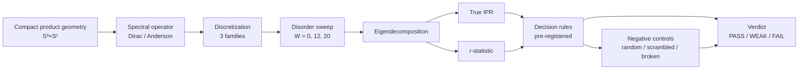

# GitHub Showcase Audit — N-7-GeoSpectra-Lab

**Date:** 2026-06-03
**Auditor:** Claude (github-showcase-architect skill, 9-stage process)
**Repo state at audit:** commit `4c21f08` + uncommitted `M .claude/settings.local.json`, `?? RERUN_SERVER_SPEC.md`, `?? scripts/run_spectral_circle_extended_v0_1_22.py`
**Branch:** main

---

## 1. Executive Verdict

**Current score: 5.4 / 10 → Target after fixes: 8.2 / 10**

**🔴 Top 3 blockers (must fix before public LinkedIn post / public repo):**

1. **SAFETY BLOCKER:** `SERVER_INFO.md` tracked in git contains live Hetzner IP `46.224.28.128`, SSH login info, server credentials reference. Also `scripts/download_v0.1.24_results.sh` hardcodes the same IP. **Public release would expose attackable infrastructure.**
2. **TRUTH BLOCKER:** `README.md` still claims `GATE4B_FSS_PASS_WITH_CAVEATS` with `7.15× contrast / FSS STRENGTHENING` from v0.1.21 — but git log shows v0.1.24 corrected rerun reached `DISCRETIZATION_SENSITIVE / GEOMETRY_AGNOSTIC (FINAL)` verdict with `WEAKENING FSS` (commits `8dfa65b`, `82850a6`). **README publishes a result that has since been falsified.**
3. **METADATA BLOCKER:** No `LICENSE` file in repo root (CITATION.cff claims `CC-BY-4.0` but file missing). CITATION.cff and `.zenodo.json` both pin to version `v0.1.16-methodology-review-draft` (2026-05-17) while current code state is post-v0.1.24. Citation will misattribute.

**Recommendation:** **DO NOT publish LinkedIn post linking to this repo until blockers 1–3 are fixed.** Estimated fix time: 60–90 minutes.

---

## 2. Score per dimension (current / target)

| Dimension | Current | Target | Notes |
|---|---:|---:|---|
| First impression | 6 | 9 | Hero present + DOI badge, but value sentence buried |
| Truthfulness | 3 | 9 | README claims a verdict that v0.1.24 has overturned |
| Reproducibility | 6 | 8 | Scripts exist, but no single "run this" entry point; requirements unpinned |
| Engineering hygiene | 5 | 8 | No CI, no LICENSE, no version pinning, version desync |
| Visual clarity | 5 | 7 | One generic image, no architecture diagram |
| Documentation structure | 8 | 9 | 50+ reports — strong asset; needs INDEX |
| Public-safety readiness | 1 | 9 | SERVER_INFO.md + script with live IP/SSH = blocker |
| Portfolio value | 6 | 9 | Methodology is the real product, not the result |
| Reviewer confidence | 7 | 9 | Honest non-claims, audit trail, null results — strong |
| **Weighted average** | **5.4** | **8.2** | |

---

## 3. Best positioning sentence

> "This repository is a **falsification-first validation harness** that helps **independent researchers and computational physicists** **distinguish a real finite-lattice spectral signal from numerical / discretization artifacts** by **running pre-registered controls, negative-control baselines, and finite-size scaling on a discretized compact product geometry (S³×S¹)**, while explicitly avoiding **any claim of physical compactification, Standard Model derivation, or thermodynamic-limit behavior**."

---

## 4. Audience-specific first impression

**Primary audience: research collaborator + computational physicist + employer in AI safety / scientific software**

| Time | What they should see |
|---|---|
| **30 sec** | (a) "validation harness, not physics proof" framing; (b) current verdict status banner (frozen v0.1.21 → corrected v0.1.24 = `DISCRETIZATION_SENSITIVE / GEOMETRY_AGNOSTIC`); (c) DOI + non-claims; (d) one-line value prop |
| **3 min** | Methodology summary (Falsification Ladder, controls, pre-registration); current geometric ladder (S³×S¹ Klein style → S³×S² Tom Lawrence redirect → S³×6D target); link to `CLAIMS_AND_CAVEATS.md`; honest "what failed" |
| **10 min** | Run `pytest -q tests/` cleanly; reproduce one figure from `reports/RUNS/`; read `docs/RESEARCH_CONTEXT.md` and `docs/OUTCOMES.md`; verify CITATION.cff matches latest tag |

---

## 5. README rewrite plan

### 5.1 Add at the very top (before current Hero)

```markdown
## ⚠️ Current Status (2026-06-03)

| Verdict | Reference |
|---|---|
| **Gate 4B v0.1.21** | `PASS_WITH_CAVEATS` — **interpretation FROZEN** (S³ Dirac operator bug, fix `093573b`) |
| **Gate 4B v0.1.24** (corrected rerun) | **`DISCRETIZATION_SENSITIVE / GEOMETRY_AGNOSTIC (FINAL)`** — signal does not survive on corrected operator |
| **Active direction** | Port harness to S³×S² (per Tom Lawrence CAMP redirect, 2026-05-26) |

This repository is a **methodology project**. The S³×S¹ case study produced a
null/limiting result on the corrected operator. The harness itself remains the
deliverable. See `reports/UNIFIED_RESULT_RECONCILIATION.md` (if present) or
latest commits for verdict provenance.
```

### 5.2 Replace the stale "Gate 4B Update (2026-05-22): ... PASS_WITH_CAVEATS"

That paragraph in the current `Current Validation Status` section is the single most misleading line in the repo. Replace it with the table above.

### 5.3 Add 13-section structure (current README has it partially)

| § | Section | Status now |
|---:|---|---|
| 1 | Hero + status banner + DOI + non-claims | partial (no status banner) |
| 2 | Why this matters | missing |
| 3 | What this repository does | present (Purpose) |
| 4 | What this repository does NOT do | present (good) |
| 5 | Quickstart (5 lines to first run) | missing — must add |
| 6 | Reproduce results (per script) | implicit in body — extract |
| 7 | Project architecture (diagram) | missing |
| 8 | Key artifacts (curated short list) | missing — README is 53KB long-form |
| 9 | Evidence / test status (CI badge, test count) | partial, stale numbers |
| 10 | Data and licensing boundaries | missing |
| 11 | Citation | present (DOI badge only) |
| 12 | Roadmap (post-CAMP S³×S² direction) | missing |
| 13 | Contact / author note | missing |

### 5.4 Move long-form sections to `docs/`

Current 53 KB README dumps full per-script results into the front page. Move to:
- `docs/3D_ANDERSON_BENCHMARK.md`
- `docs/RADION_STABILIZATION.md`
- `docs/MONOPOLE_INDEX_CONTROL.md`
- `docs/SPECTRUM_WINDOW_DIAGNOSTICS.md`

Keep README under **400 lines**. Long-form science = `reports/`; entry doc = `README.md`.

---

## 6. Visual asset plan

### 6.1 Social preview (1280 × 640 px)

Required:
- Title: `GeoSpectra Lab`
- Subtitle: `Falsification-first validation harness for compact product manifolds`
- 3 proof points:
  - `203 tests · 9-batch pre-registered grid · Zenodo DOI`
  - `Caught its own operator bug (v0.1.21 → v0.1.24)`
  - `Honest negative result · methodology > metric`
- Footer: `S³×S¹ → S³×S² · per Tom Lawrence redirect, CAMP 2026-05-26`

Save spec at `docs/assets/social_preview_spec.md`.

### 6.2 Architecture diagram (Mermaid)



Save at `docs/ARCHITECTURE.md`.

### 6.3 Result dashboard (README table)

```markdown
| Metric | Value | Source |
|---|---|---|
| Tests | 43 test files | `ls tests/*.py` |
| Last documented run | 203 passed, 1 warning | `reports/VALIDATION_STATUS.md` (v0.1.15) |
| CI status | ❌ no GitHub Actions workflow | needs `.github/workflows/test.yml` |
| Coverage | not measured | needs `coverage` integration |
| License | CC-BY-4.0 (CITATION.cff) | ❌ no `LICENSE` file in root |
| Citation | `10.5281/zenodo.20252651` | `.zenodo.json` (v0.1.16 — stale) |
| Latest release tag | `v0.1.19-track-c-gate-1` | `git tag` (v0.1.20–v0.1.24 untagged) |
| Open blockers | Compute (≥32 GB RAM); S³×S² port | this file |
```

---

## 7. Engineering hygiene findings

| Check | Status | Evidence | Fix |
|---|---|---|---|
| Tests pass | UNVERIFIED | last documented `203 passed` is from v0.1.15 (2026-05-15) | Run `pytest -q tests/` now, update README |
| Lint clean | UNVERIFIED | `.ruff_cache` exists but no committed `ruff check` log | Run `ruff check .` and document |
| CI exists | ❌ NO | no `.github/workflows/` directory | Add minimal `test.yml` workflow |
| LICENSE | ❌ NO | `ls LICENSE*` → not found; CITATION.cff says CC-BY-4.0 | Create `LICENSE` file with CC-BY-4.0 text |
| CITATION.cff | ⚠️ STALE | version `v0.1.16-methodology-review-draft` (2026-05-17) | Bump to current state, update abstract |
| CHANGELOG.md | ❌ NO | no `CHANGELOG.md` in root | Create with v0.1.15 → v0.1.24 entries |
| No tracked __pycache__ | ⚠️ PARTIAL | `tests/__pycache__` and `scripts/__pycache__` visible in `ls` — check `git ls-files` | `git rm -r --cached tests/__pycache__ scripts/__pycache__` if tracked |
| No tracked secrets | 🔴 **VIOLATION** | `SERVER_INFO.md` tracked, contains live IP `46.224.28.128` + SSH info | `git rm --cached SERVER_INFO.md` + add to `.gitignore` + **rewrite history with BFG** |
| No private data | ⚠️ REVIEW | 4 PDFs and 4 large `.txt` files in root (Tom's papers? personal research notes?) — see Stage 7 | Inventory + decide per file |
| `.gitignore` correct | ⚠️ WEAK | misses `*.pdf`, `*.docx`, `*SERVER*`, `*credentials*`, `*.bak` | Strengthen (see §10 fix list) |
| Reproducibility scripts run | UNVERIFIED | scripts exist, README describes commands — but no end-to-end test | Add `make reproduce` or `scripts/run_all_mvp.py` smoke test |
| Idempotent artifacts | UNKNOWN | `reports/RUNS/*` are timestamped — non-idempotent by design | Document this in README |
| Package version matches | ❌ NO | `.zenodo.json` and `CITATION.cff` say `v0.1.16`; latest git tag `v0.1.19`; current state post-v0.1.24 | Sync all three |
| Release tag exists | ❌ NO for v0.1.20+ | git tags stop at `v0.1.19-track-c-gate-1` despite v0.1.20, v0.1.21, v0.1.22, v0.1.24 in code | Tag retroactively or document why untagged |

---

## 8. Public-safety findings (🔴 BLOCKING)

### 8.1 Tracked sensitive files

```
SERVER_INFO.md                                    🔴 BLOCKER — live Hetzner IP, root SSH info
scripts/download_v0.1.24_results.sh               🔴 BLOCKER — hardcodes root@46.224.28.128
PROJECT_STATUS_CHECKLIST.md                       ⚠️ WARNING — mentions IP + Hetzner Console
RERUN_SERVER_SPEC.md (untracked)                  ✅ OK — not in git yet, keep untracked or sanitize
```

### 8.2 Tracked third-party / personal materials in root

```
Toy-модель стабилизации радиона...PDF (650 KB)                ⚠️ Provenance unknown — own work or copied?
Геометрическое происхождение группы СМ...PDF (1.6 MB)         ⚠️ Provenance unknown — likely third-party
Обойти проблему хиральных фермионов...промт.txt               🔴 Personal research prompt — REMOVE
глубокое иследование общее 1.txt                              🔴 Personal research notes — REMOVE
исследовательская база проекта Covariant...txt                ⚠️ Own research notes — move to docs/_private/
калуца–клейновская компактификация.txt                        ⚠️ Own research notes — move to docs/_private/
```

### 8.3 Git history exposure

Commits that introduce sensitive content (need history rewrite before public release):

```
eb4b6c2 infra: add server automation scripts + hardware requirements
116247a docs(controls): add server handoff for v0.1.22 remote execution
```

### 8.4 Required actions before any public step (commands)

```bash
# 1. Stop tracking sensitive files
git rm --cached SERVER_INFO.md
git rm --cached scripts/download_v0.1.24_results.sh
git rm --cached "Обойти проблему хиральных фермионов убедительно тоже промт напиши для глубокого иследования.txt"
git rm --cached "глубокое иследование общее 1.txt"

# 2. Strengthen .gitignore (append these lines)
echo "
# Sensitive infrastructure
SERVER_INFO.md
*SERVER*.md
*.env
*credentials*
*.pem
*.key
hetzner_*

# Personal research files in root
глубокое*
Обойти*
исследовательская*
калуца*

# Third-party PDFs
*.pdf
" >> .gitignore

# 3. Commit
git add .gitignore
git commit -m "security: stop tracking server info, credentials, personal notes"

# 4. Rewrite history (DESTRUCTIVE — only if going public)
# Install: pip install git-filter-repo
git filter-repo --invert-paths --path SERVER_INFO.md --path "scripts/download_v0.1.24_results.sh"
# This will rewrite all commits — coordinate with any collaborators

# 5. Force-push (only after history rewrite)
# git push --force origin main
```

**Until §8 actions are completed: keep repo PRIVATE. Do not link in LinkedIn post.**

---

## 9. Overclaim gate findings

Claim-by-claim review of current README and CITATION.cff:

| Claim location | Claim text | Status | Action |
|---|---|---|---|
| README `## Purpose` | "scientific-computing workbench, not a claim that covariant compactification has been proven" | ✅ `[VERIFIED-REAL]` | Keep |
| README `## Research Context and Inspiration` | "does **not** test or validate covariant compactification directly" | ✅ `[VERIFIED-REAL]` | Keep |
| README `## What This Project Does NOT Prove` (8 items) | "does not prove ..." × 8 | ✅ `[VERIFIED-REAL]` | Keep, strongest section in repo |
| README `## Current Validation Status` | "**S³×S¹ Gate 4B FSS (v0.1.21)** \| **GATE4B_FSS_PASS_WITH_CAVEATS**" | 🔴 `[CONTRADICTS]` git log (`8dfa65b`, `82850a6`, `4c21f08`) | **REPLACE** with v0.1.24 verdict |
| README "Gate 4B Update (2026-05-22): ... 7.15× ... FSS trend STRENGTHENING" | concrete numbers from frozen-interpretation v0.1.21 | 🔴 `[FROZEN]` — must not present as current | Add "FROZEN — see v0.1.24" prefix |
| README `## Current Baseline: v0.1.15-...` line `| Git | The folder is not currently a git repository. |` | factually wrong — repo IS a git repository, pushed to GitHub | 🔴 `[CONTRADICTS]` reality | Fix or remove |
| CITATION.cff `abstract` | "Ring/alpha=0 caveat resolved via targeted follow-up (s1_size≥64 empirical guideline)" | ⚠️ `[VERIFIED-SYNTHETIC]` — only on the data tested | Add caveat clause |
| CITATION.cff `version` | `v0.1.16-methodology-review-draft` (2026-05-17) | ⚠️ `[STALE]` | Bump version |
| `.zenodo.json` `version` | same `v0.1.16` | ⚠️ `[STALE]` | Bump or document why frozen |

**Rule:** Stage 8 cannot pass while README presents a verdict that subsequent commits have falsified.

---

## 10. 30-minute fixes (do these tonight before LinkedIn DM Tom)

1. **(5 min)** `git rm --cached SERVER_INFO.md scripts/download_v0.1.24_results.sh` + strengthen `.gitignore` (commands in §8.4) + commit
2. **(5 min)** Add `LICENSE` file in root with CC-BY-4.0 text (the version that matches `CITATION.cff`)
3. **(10 min)** Add the **status banner** from §5.1 to the very top of `README.md`
4. **(5 min)** Replace the misleading "Gate 4B Update (2026-05-22): ... PASS_WITH_CAVEATS ... 7.15× ... STRENGTHENING" with the corrected verdict table
5. **(5 min)** Fix the wrong line `| Git | The folder is not currently a git repository. |` — remove or correct to `| Git | https://github.com/sergeeey/N-7-GeoSpectra-Lab |`

**After these 5 fixes:** safe to share repo link with Tom Lawrence / Buckholtz / LinkedIn audience. **Not** yet at full showcase quality, but no longer publishes false claims and no longer exposes infrastructure.

---

## 11. 2-hour fixes (do this week)

1. **(30 min)** Bump `CITATION.cff` and `.zenodo.json` to current state; tag latest commit as `v0.1.24-discretization-sensitive-final`
2. **(30 min)** Write `CHANGELOG.md` for v0.1.15 → v0.1.24
3. **(30 min)** Add minimal CI: `.github/workflows/test.yml` running `pytest -q tests/`
4. **(15 min)** Run `pytest -q tests/` locally, capture output to `reports/PYTEST_LATEST.txt`, link in README
5. **(15 min)** Add architecture Mermaid diagram (from §6.2) to `docs/ARCHITECTURE.md` and link from README

---

## 12. Before-public-release checklist

Mandatory gates before flipping the repo to public OR linking in LinkedIn post:

- [ ] **§8 Public-safety actions all done** (untrack + strengthen `.gitignore` + commit)
- [ ] **`git filter-repo` history rewrite executed** to scrub `SERVER_INFO.md` from past commits
- [ ] **Server `46.224.28.128` confirmed deleted** in Hetzner Console (so leaked IP becomes harmless)
- [ ] **README status banner present** (no falsified verdicts visible)
- [ ] **LICENSE file in root** (CC-BY-4.0)
- [ ] **CITATION.cff version matches current code state**
- [ ] **5 personal `.txt`/`.pdf` files in root reviewed** — removed, moved, or kept with explicit consent
- [ ] **`pytest -q tests/` ran and result documented**
- [ ] **No `*.env`, `*.key`, `*.pem` anywhere in `git ls-files`**
- [ ] **Manual spot-check:** clone the public repo into a temp dir, `git log --all --oneline | head -50` — no IP, no SSH, no credentials anywhere
- [ ] **24-hour cooling-off period** between fixing and publishing (catch what you missed)

**Until all 11 items are checked: repo stays private OR is not linked publicly.**

---

## Summary card

```
Project:           N-7-GeoSpectra-Lab
Type:              Solo computational physics / methodology toolkit
Real product:      The falsification harness (not the S³×S¹ result)
Audience target:   research collaborator + AI safety / sci-software employer
Current score:     5.4 / 10
Target score:      8.2 / 10 (after §10 fixes — 30 minutes)
Public-release ready: ❌ NO (3 blockers — §1)
Show-Tom-now ready:   ⚠️ ONLY after §10 fixes (30 min)
```

---

**Status:** AUDIT COMPLETE — no fixes implemented (read-only mode)
**Next decision (operator):** approve §10 fixes individually before any commits
**No history rewrite performed, no files removed, no commits made**

---

**Generated:** 2026-06-03 by `github-showcase-architect` skill
**Inputs read:** `README.md` (head 500 lines), `PROJECT_STATUS_CHECKLIST.md`, `SERVER_INFO.md`, `CITATION.cff`, `.zenodo.json`, `.gitignore`, `requirements.txt`, `pytest.ini`, `scripts/download_v0.1.24_results.sh`, `docs/RESEARCH_CONTEXT.md`, `docs/OUTCOMES.md` (head 100 lines), `git log/tag/ls-files` output
